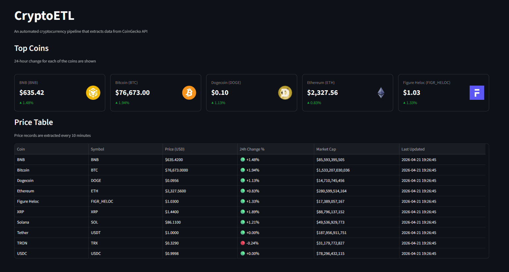

<div align="center">

# CryptoETL
### Crypto ETL Pipeline


**A Python-based ETL pipeline that extracts cryptocurrency market data from the CoinGecko API, transforms it using pandas, loads it into PostgreSQL, and serves a live Streamlit dashboard for price monitoring and trend analysis.**

</div>

## SETUP & INSTALLATION

### 1. Clone the repository
```bash
git clone https://github.com/mustafamclngn/CryptoETL.git
cd CryptoETL
```

### 2. Create and activate a virtual environment
```bash
python -m venv venv

# Windows
venv\Scripts\activate

# Mac/Linux
source venv/bin/activate
```

### 3. Install dependencies
```bash
pip install -r requirements.txt
```

### 4. Create the PostgreSQL database
```bash
createdb crypto_db
```

### 5. Configure environment variables
Create a `.env` file in the project root:

---

## HOW TO RUN

### Run the pipeline once
```bash
python pipeline.py
```

### Run the scheduler (fetches every 10 minutes)
```bash
python scheduler.py
```

### Launch the dashboard
Open a second terminal and run:
```bash
streamlit run dashboard.py
```
Then open your browser at `http://localhost:8501`

> **Tip:** Run the scheduler and dashboard at the same time in two separate
> terminals to see live data updates on the dashboard.

---
<div align="center">
  
## DASHBOARD


</div>
---

## DASHBOARD FEATURES
- **Top coins** — metric cards showing current price and 24h change
- **Price Table** — latest prices for all 10 tracked coins with color-coded 24h change

---

## FUTURE DEVELOPMENTS
- [ ] Dockerize the pipeline and database
- [ ] Replace APScheduler with Apache Airflow
- [ ] Add data quality checks with Great Expectations
- [ ] Add dbt models for cleaned views on top of raw data
- [ ] Deploy dashboard to Streamlit Cloud

---
